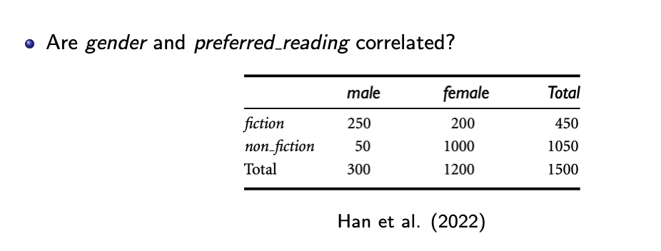
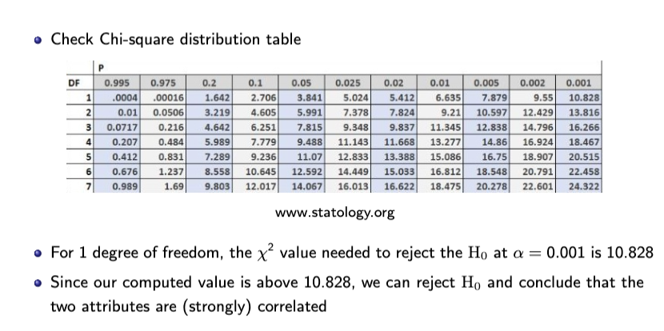

Hai biến **rời rạc / categorical** → không dùng Pearson. Dùng **χ² (chi-square)** như Han.

## 1. Bảng quan sát (observed)

|              | male | female | Total |
| ------------ | ---: | -----: | ----: |
| fiction      |  250 |    200 |   450 |
| non\_fiction |   50 |   1000 |  1050 |
| Total        |  300 |   1200 |  1500 |

## Tần suất kỳ vọng nếu độc lập:

eij = (count(A = ai ) × count(B = bj )) / n
\= Tổng hàng i × Tổng cột j / Tổng tổng

|              |                male |                 female |
| ------------ | ------------------: | ---------------------: |
| fiction      | (450x300)/1500 = 90 | (450\*1200)/1500 = 360 |
| non\_fiction |  1050\*300/1500=210 |    1050\*1200/1500=840 |

## Tính χ²

χ² = Σ (Oij - Eij)² / Eij

fiction\_male = (250-90)^2/90 = 284.44
fiction\_female = (200-360)^2/360 = 71.11
non\_fiction\_male = (50-210)^2/210 = 121.90
non\_fiction\_female = (1000-840)^2/840 = 30.48

χ² = 284.44 + 71.11 + 121.90 + 30.48 = 507.93

## Kết luận

- df = (số hàng-1)(số cột -1) = (2-1)(2-1) = 1 => Chọn hàng 1 trong bản dưới.

- Ngưởng thương dùng (α = 0.001): khoảng **10.83 |**
- Nếu X^2  = 507.94 > 10.828 => Reject

H0 ở đây là: "gender and preferred reading correlated" = True

Giả định H0 là đúng. Với df=1 (ở đề bài này) .  Giá trị 10.828 là giá trị lớn nhất chập nhận được theo phân phối. nếu > số này thì kết luận giả định H0 là sai. => Có thể loại bỏ bớt 1 biến.

\=> Giới tính và thể loại đọc không liên quan.

Phân phối với giả định H0 là đúng.

Chọn a = 0.001 là kiểm soát false negative là dưới 1% (1/100 = 0.001)

