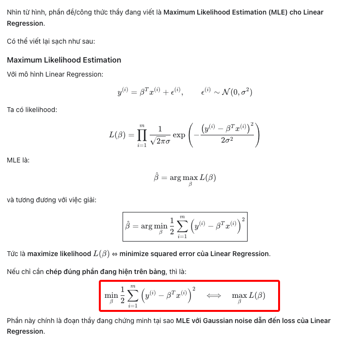

```

X*B(beta) =  | x1_T*B | = R_n (Vector chiều)
             | x2_T*B |
             | ...    |
             | xn_T*B |

y = | y1 |
    | y2 |
    | ... |
    | yn |


y-X*B(beta) =  | y1 - x1_T*B | = R_n (Vector chiều)
               | y2 - x2_T*B |
               | ...    |
               | yn - xn_T*B |

* Do X*B và Y đều là vector N chiều, nên y-X*B(beta) là vector N chiều


vd: a = | a1 | 
        | a2 |

    b = | b1 | 
        | b2 |

    a_T*b = a1*b1 + a2*b2


(1/2)(y-X*B(beta))_T*(y-X*B(beta))  (Tích vô hướng)
  = (1/2)((y_1 - x_1_T*B)^2 + (y_2 - x_2_T*B)^2 + ... + (y_n - x_n_T*B)^2)

  = (1/2)Sum(i=1 to n)(y_i - x_i_T*B)^2
  = (1/2)Sum(i=1 to n)(y_i - B_T*x_i)^2

```


Bài tập:

Lấy đạo hàm cấp 1 của:

```

(1/2)(Y-XB)_T*(Y-XB) = L_B

Đạo hàm cấp 1 của L_B theo B là:

Bước 1: Khai triển (Y-XB)_T*(Y-XB)

Đặt A = Y, C = X*B
Công thức: (A-C)_T = A_T - C_T

=> (A-C)_T*(A-C)
 = (A_T - C_T)*(A - C)
 = A_T*A - A_T*C - C_T*A + C_T*C
 = Y_T*Y - Y_T*(X*B) - (X*B)_T*Y + (X*B)_T*(X*B)   (Thế A = Y, C = X*B)
 = Y_T*Y - Y_T*X*B - B_T*X_T*Y + B_T*X_T*X*B

<=> L_B = 1/2(Y_T*Y - Y_T*X*B - B_T*X_T*Y + B_T*X_T*X*B)

* Vì Y_T*X*B và B_T*X_T*Y đều là số (scalar) nên bằng nhau:
  Y_T*X*B = B_T*X_T*Y
  => L_B = 1/2(Y_T*Y - 2*Y_T*X*B + B_T*X_T*X*B)

* Nhân được A_T*A vì: A cột n×1, A_T hàng 1×n → (1×n)(n×1) = 1×1 (một số).
  (Khác với A*A_T ra ma trận n×n; loss dùng A_T*A.)


* Đạo hàm của L_B theo B: (B là vector cột)

L_B = 1/2(Y_T*Y - 2*Y_T*X*B + B_T*X_T*X*B)

Quy ước gradient cột: kết quả dL/dB là vector cùng chiều với B.

dL_B/dB = 1/2(0 - 2*X_T*Y + 2*X_T*X*B)

= -X_T*Y + X_T*X*B

# 0          : Y_T*Y không phụ thuộc B → đạo hàm = 0
# -2*Y_T*X*B : tuyến tính theo B; gradient cột của Y_T*X*B là X_T*Y
#              (vì Y_T*X*B = (X_T*Y)_T*B); nhân 1/2 và hệ số -2 → -X_T*Y
# B_T*(X_T*X)*B : dạng B_T*A*B với A = X_T*X đối xứng;
#                 gradient cột = 2*A*B = 2*X_T*X*B; nhân 1/2 → X_T*X*B

Cho đạo hàm = 0 (điểm cực tiểu):

<=> -X_T*Y + X_T*X*B = 0

<=> X_T*X*B = X_T*Y

<=> B = (X_T*X)^-1 * X_T*Y

(Lưu ý: không viết Y_T*X ở vế phải khi B là cột — Y_T*X là hàng 1×p,
 còn X_T*X*B và X_T*Y là cột p×1.)

```

Chỉ dùng công thức này khi ma trận (X_T*X) nghịch đảo được.
Ma trận nghịch đảo được khi các cột độc lập tuyến tính (full rank).
Nếu các cột phụ thuộc tuyến tính → không có nghịch đảo → công thức B = (X_T*X)^-1*X_T*Y không dùng được.

VD — cột phụ thuộc tuyến tính (không đảo được):

```
A = | 1  2 |
    | 2  4 |
```

Cột 2 = 2 × cột 1 → phụ thuộc. det(A) = 1*4 - 2*2 = 0 → không có A^-1.

VD — cột độc lập (đảo được):

```
A = | 1  2 |
    | 3  5 |
```

Không cột nào là bội của cột kia. det(A) = 1*5 - 2*3 = -1 ≠ 0 → có A^-1.

Trong hồi quy: nếu 2 feature trùng thông tin (vd x2 = 2*x1) thì cột của X phụ thuộc
→ X_T*X suy biến → không nghịch đảo.


# Câu hỏi:
- Tại sao lại dùng hàm loss là : (1/2)Sum(i = 1 to n)(y_i - x_i*B_T)^2 ?
- Tại sao lại bình phương mà không dùng |y_i - x_i*B_T| ?
- Tại sao lại có hệ số 1/2 ?
-> Vì ta giả sử data của chúng ta tuân theo phân phối chuẩn.
-> Dùng trị tuyệt đối vẫn đúng, bỏ 1/2 vẫn đúng, nhưng data phải tuân theo 1 phân phối nào đó mà không phải phân phối chuẩn.
==> Nếu data tuân theo phân phối chuẩn thì công thức trên là tốt nhất.
==> Công thức ở trên là khi triển của công thức của phân phối chuẩn chứ không phải tự nhiên mà có.

Vd
```

P(y_i) = 1/sqrt(2*pi*sigma^2) * exp((-1/2)*(y_i - x_i*B_T)^2/sigma^2) 

Đây là hàm mật độ xác suất của phân phối chuẩn.

=> Đây chỉ là hàm sác xuất của 1 điểm data point.

Vậy n điểm thì sao? y_1, y_2, ..., y_n

P(y_1, y_2, ..., y_n) = P(y_1) * P(y_2) * ... * P(y_n)= ?
Giả sử y_1, y_2, ..., y_n độc lập với nhau.

=> Xác xuất của 1 tích = tích các xác suất
=> P(y_1, y_2, ..., y_n) = P(y_1) * P(y_2) * ... * P(y_n)
= Pi(i = 1 to n) P(y_i) (Hàm likelihood)

L(B) = Pi(i = 1 to n) P(y_i) = Pi(i = 1 to n) 1/sqrt(2*pi*sigma^2) * exp((-1/2)*(y_i - x_i*B_T)^2/sigma^2)   (Hàm likelihood)


=> Maximum Likelihood Estimation (MLE)


```

Chúng ta đã học P(A giao B) = P(A) * P(B) | Khi A và B **độc lập** với nhau.

BÀI TẬP:

