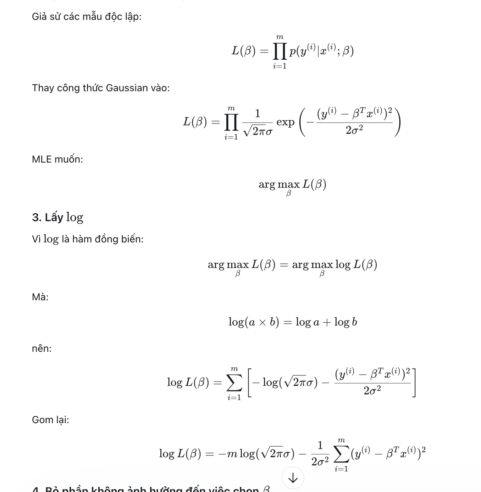

```


!
y_i = B_T * x_i +e_i
data    true     noise


e_i ~ N(0, sigma^2) | e_i tuân theo phân phối chuẩn với giá trị trung bình 0 và phương sai sigma^2

=> y_i ~ N(B_T * x_i, sigma^2) | Nghĩa là y_i cũng tuân theo phân phối chuẩn.


y_i+n ~ N(n, sigma^2)

Likelihood L
     ↑
     │            ●  ← maximum
     │          /   \
     │        /       \
     │      /           \
     │____/_______________\_____→ β
                     β*

Hàm mật độ xác xuất của 1 tập hợp tuân theo phân phối chuẩn là:

P(y_i | B_T, sigma^2) = 1 / (sqrt(2 * pi * sigma^2)) * exp(-(y_i - B_T * x_i)^2 / (2 * sigma^2))


Hàm Likelihood L là tích của các hàm mật độ xác xuất của tất cả các quan sát:
L(B_T, sigma^2) = Π P(y_i | B_T, sigma^2)
= 1 / (sqrt(2 * pi * sigma^2))^n * exp(-Σ(y_i - B_T * x_i)^2 / (2 * sigma^2))

```
Hàm like hood là hàm của B_T và sigma^2.


Do trong công thức likelihood có exp không tính được nên phải tìm cách biến đổi.

Quang sát thấy đây là 1 tích, mà để giải quuyết 1 tích thì ta có thêm log để biến đổi thành tổng.

VD: Log(a * b) = Log(a) + Log(b)

=> Log( Π P(y_i | B_T, sigma^2)
= 1 / (sqrt(2 * pi * sigma^2))^n * exp(-Σ(y_i - B_T * x_i)^2 / (2 * sigma^2)))

= Sum(Log(1/sqrt(2 * pi * sigma^2))) + Sum(Log(-(y_i - B_T * x_i)^2 / (2 * sigma^2)))

Mà "Sum(Log(1/sqrt(2 * pi * sigma^2)))" không chứa B, nên nó sẽ là 1 hằng số.

=> Có thể xem nó là 1 hằng số K

<=> K+Sum(Log(-(y_i - B_T * x_i)^2 / (2 * sigma^2)))


<=> K -n*(y_i - B_T * x_i)^2 / (2 * sigma^2)

Nó sẽ thành dạn A*x+B
với A*x = -n*(y_i - B_T * x_i)^2 / (2 * sigma^2)
Và B = K

Ta thấy "(y_i - B_T * x_i)" là hàm loss và nó trái dấu với 




* Log (exp(x)) = x


